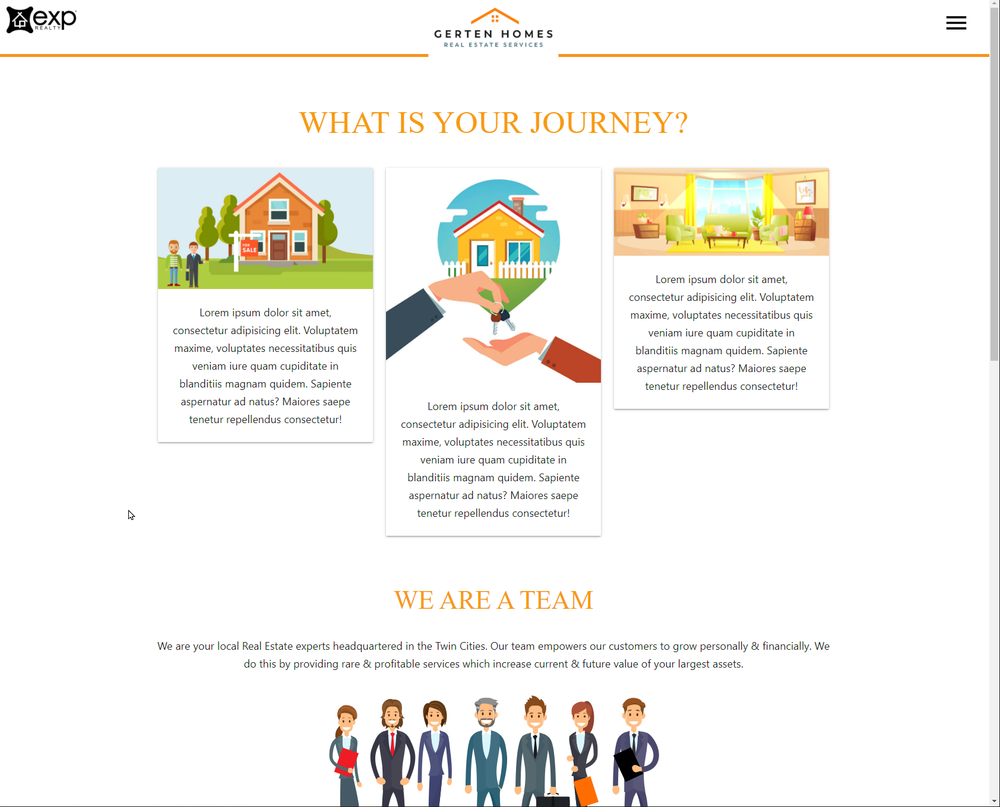
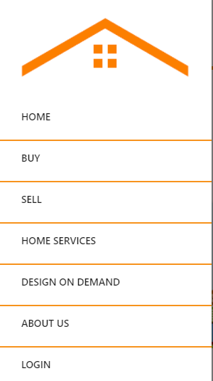
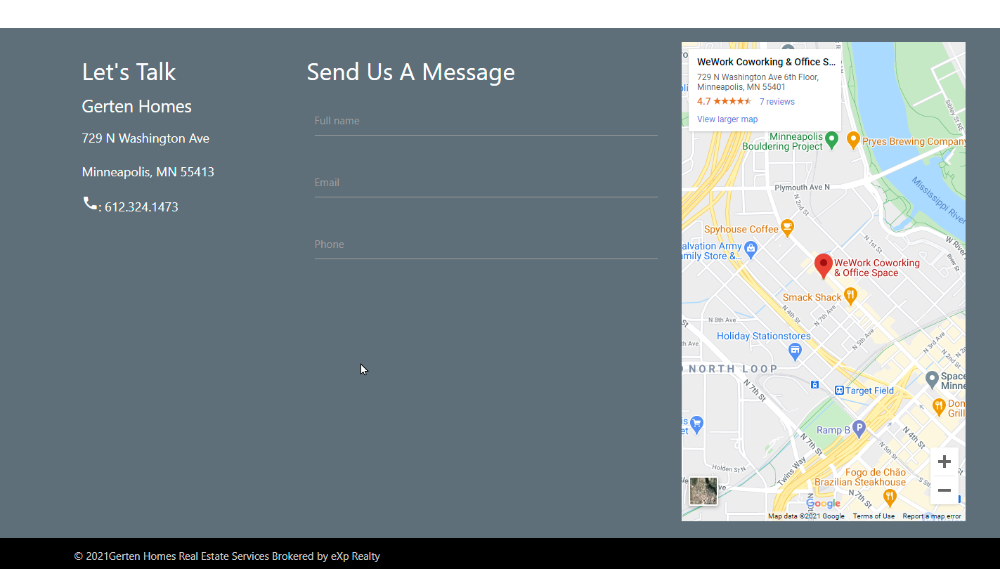

# Welcome to Gerten Homes

## Description

Gerten Homes has requested a web app that provides end user a dynamic web experience, and drives website interaction and lead generations.

The application contains experiences based on user authentication, and allows the real estate organization the ability to share additional content with users (once logged in), generate leads through a contact form, store all data in a database, and tracks web interactions using the Google Analytics platform.

### Table of Contents

- [Website](#website)
- [Presentation](#presentation)
- [Built With](#built-with)
- [Contribution](#contribution)
- [Screenshots](#screenshots)
- [Future Enhancements](#future-enhancements)

---

## Website

- https://gertenhomes.herokuapp.com/

[Back to Contents](#table-of-contents)

---

## Presentation

- https://docs.google.com/presentation/d/1veAYcpV-VAG4281r57_i6wLnQDisUsCbpAAF6HsickM/edit?usp=sharing

[Back to Contents](#table-of-contents)

---

## Built With

- [Bcrypt](https://www.npmjs.com/package/bcrypt)
- [Env](https://www.npmjs.com/package/env)
- [Express](https://www.npmjs.com/package/express)
- [Handlebars](https://www.npmjs.com/package/handlebars)
- Google Analytics
- MySQL
- [Materialize](https://materializecss.com/)
- [Sequelize](https://www.npmjs.com/package/sequelize)

[Back to Contents](#table-of-contents)

---

## Contribution

- [Anthony Potts](https://github.com/anthonypotts)
- [Jake Nystrom](https://github.com/minnesotaNyst)
- [Nathan Potts](https://github.com/nathan-potts41)
- [Will Pearson](https://github.com/willp429)
- [Andrew Warmath]()

---

## Screenshots

Landing page providing a clean and dynamically responsive website for new and previous visitors, with a menu structure.

Simple navigational menu, accessible from all pages.

Contact form with Google Maps location

Login and new user signup page

---

## Future Enhancements

- Integrate CRM API of customer's choice (follow-up boss, salesforce, etc.)
- Add additional site interaction
- Continue to optimize Google Analytics tracking
- Build full content management system backend
